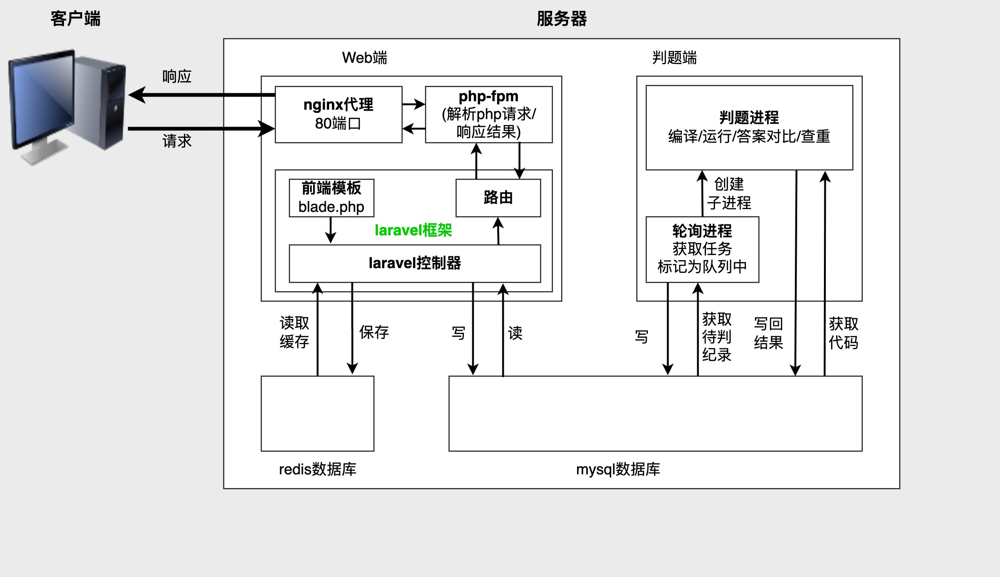
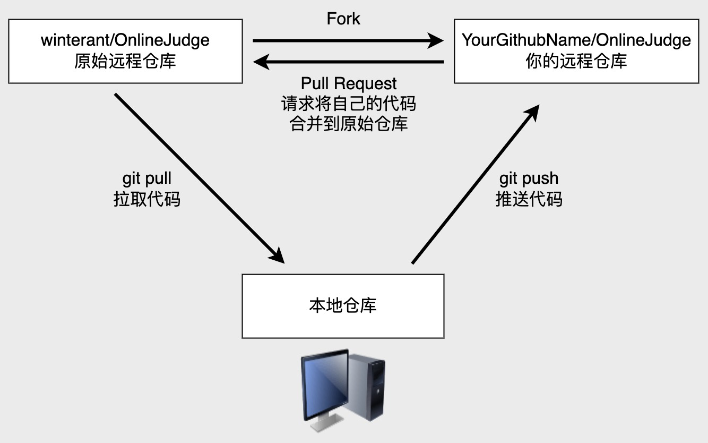

# 开发手册

>说明：系统在开发初期并没有考虑过多的开发原则，没有实现前后端分离，没有遵循RESTful标准等。
即日起，开发将尽最大可能地遵循[前后端接口规范 - RESTful版](https://github.com/winterant/restful-api-specification)。

## 生产环境



生产环境目前采用`docker-compose`编排方式部署，包含4个镜像，分别是
- `winterant/lduoj:1.2`; [Web端](https://github.com/winterant/OnlineJudge)，基于Ubuntu20.04镜像构建；暴露80端口；
- `winterant/judge:1.2`; [判题端](https://github.com/winterant/judge)，基于Ubuntu20.04镜像构建；
- `mysql:8.0`; 官方镜像；
- `redis:7.0`; 官方镜像；

编排启动的容器将以只读方式读取环境变量配置文件`lduoj.conf`（详情参考[deploy分支](https://github.com/winterant/OnlineJudge/tree/deploy)）。

## 本地开发

>开发前，你需要对[Laravel框架](https://learnku.com/docs/laravel/6.x)有一些基本的了解。  
>本地开发最简单的方法是按照生产环境的部署方式部署到本地电脑，并将源码映射到宿主机，在本地打开源码目录进行开发即可。

### 1. 个人电脑需要安装的软件

#### 代码编辑器或IDE（二选一）

- [vscode](https://code.visualstudio.com)（推荐）；  
  vscode是一个编辑器，你需要安装一些必备的插件才能进行开发：
     - Chinese (Simplified)(简体中文)（可选；汉化vscode主界面）
     - PHP Intelephense（必需；php语法提示工具）
     - Laravel Blade Snippets（必需；前端模板提示工具）
     - Laravel Blade formatter（必需；前端模板格式化工具）
     - Git History（可选；可视化查看文件修改历史）
- [PhpStorm](https://www.jetbrains.com/phpstorm/)；

#### docker

不论你是用哪种操作系统，你需要安装对应平台的[docker](https://www.docker.com/)。
对于windows、macOS，docker桌面版安装好自带`docker-compose`，可以验证：
```bash
docker-compose -v
```
如果执行失败，则需自行安装`docker-compose`。

#### git
你必须安装[git](https://git-scm.com/)才能向远程仓库贡献代码。
[git基础操作笔记](https://blog.csdn.net/winter2121/article/details/124227331)。

注意：现在github口令验证变严格了，从本地向远程仓库推送代码，只能通过ssh方式，所以你需要参考[git基础操作笔记](https://blog.csdn.net/winter2121/article/details/124227331)配置好github access ssh key。


### 2. 将项目部署到本地

1. 获取编排脚本和配置文件；
```bash
git clone -b deploy https://github.com/winterant/OnlineJudge.git
cd OnlineJudge
```
PS:也可以自己从网页下载。

下文所有开发操作都将发生在文件夹`OnlineJudge`内，所以建议你把它放在一个你熟悉的位置（Windows用户不要放在C盘）。

2. 修改`docker-compose.yml`，配置源码挂载到本地；
```
# reduced code...

services:
  web:
    # reduced code...
    volumes:
      - ./data/web:/app  # 取消原挂载路径，改为此挂载路径

# reduced code...
```

3. 启动容器；
```bash
docker-compose up -d
```
注意命令要在宿主机文件夹`OnlineJudge`下执行。稍等几分钟，docker会自动下载好镜像并启动容器。

4. 打开浏览器访问<http://localhost:8080>，成功显示首页则代表部署成功。

### 3. 开始开发

1. 使用vscode打开文件夹`OnlineJudge/data/web/`，即可看到Web端源码。
2. 配置git仓库；
   ```bash
   git init  # 初始化仓库
   git remote add origin git@github.com:winterant/OnlineJudge.git  # 添加原始远程仓库，用于pull获取最新代码
   git remote add forked git@github.com:<GithubUser>/OnlineJudge.git  # 添加个人远程仓库，用于push改动的代码
   ```
   说明：上述命令配置了两个远程仓库，`origin`是原始仓库，仅[winterant](https://github.com/winterant)拥有推送权限；`forked`是你自己的仓库，这个仓库应当是你fork自原始仓库。
   `origin`、`forked`仅仅是在本地的别名，你可以随便起名字，远程仓库不会得知它们。

   <div align="center">
    
   </div>

   >然而，如果[winterant](https://github.com/winterant)给你了原始仓库的推送权限，那么你无需fork原始仓库，只配置一个原始仓库就可以了。

3. 拉取最新代码；
```bash 
git branch --set-upstream-to=origin/master master  # 设置本地分支master的获取源, 注意本地分支名也可能是main
git pull  # 将从远程仓库origin/master获取最新代码
```
4. **开始愉快地开发吧！**

<div align="center">
  
</div>

需要注意的问题：
- 修改配置类文件后，需要进入容器内执行`php artisan opimize`使配置重新被加载才能生效；

1. 开发完某个功能后，你需要提交(commit)你的代码（注意这不代表提交到远程仓库，仅仅是提交到本地仓库）；
  你可以使用vscode自带的代码管理器来提交，也可以使用以下命令进行提交：
  ```bash
  git add .  # .代表当前项目目录全部添加到暂存区等候提交，你也可以替换成你希望提交的那部分文件
  git commit -m "committing information."
  ```

6. 向远程仓库推送代码；将本地的改动推送到你的远程仓库：
```bash
git push --set-upstream forked master
```
然后在你的远程仓库中，向原始仓库发起Pull Request，并联系[winterant](https://github.com/winterant)审阅、合并代码。

>然而，如果你拥有原始仓库的推送权限，那么你无需fork原始仓库，而是直接向原始仓库推送代码：
>```bash
>git push --set-upstream origin master
>```
