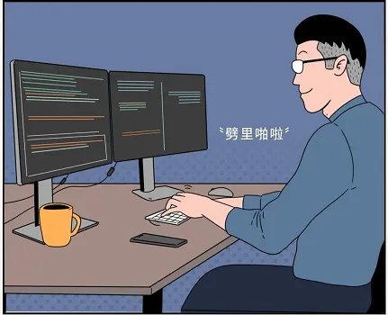

# 开发手册

>说明：系统在开发初期并没有考虑过多的开发原则，没有实现前后端分离，没有遵循RESTful标准等。
即日起，开发将尽最大可能地遵循[前后端接口规范 - RESTful版](https://github.com/winterant/restful-api-specification)。

## 生产环境


生产环境目前采用`docker-compose`编排方式部署，包含4个镜像，分别是
- `winterant/lduoj`; [Web端](https://github.com/winterant/OnlineJudge)，基于Ubuntu22.04镜像构建；暴露80端口；
- `winterant/judge`; [判题端](https://github.com/winterant/judge)，基于Ubuntu20.04镜像构建；
- `mysql:8.0`; 官方镜像；
- `redis:7.0`; 官方镜像；

编排启动的容器将以只读方式读取环境变量配置文件`lduoj.conf`（详情参考[deploy分支](https://github.com/winterant/OnlineJudge/tree/deploy)）。

## 本地开发

>开发前，你需要对[Laravel框架](https://learnku.com/docs/laravel/9.x)有一些基本的了解。  
>本地开发最简单的方法是按照生产环境的部署方式部署到本地电脑，并将源码映射到宿主机，在本地打开源码目录进行开发即可。

### 一. 个人电脑需要安装的软件

#### 1. 代码编辑器或IDE（二选一）

- [vscode](https://code.visualstudio.com)（推荐）；  
  vscode是一个编辑器，你需要安装一些必备的插件才能进行开发：
     - Chinese (Simplified)(简体中文)（可选；汉化vscode主界面）
     - PHP Intelephense（必需；php语法提示工具）
     - Laravel Blade Snippets（必需；前端模板提示工具）
     - Laravel Blade formatter（必需；前端模板格式化工具）
     - Git History（可选；可视化查看文件修改历史）
- [PhpStorm](https://www.jetbrains.com/phpstorm/)；

#### 2. docker

不论你是用哪种操作系统，你需要安装对应平台的[docker](https://www.docker.com/)。
对于windows、macOS，docker桌面版安装好自带`docker-compose`，可以验证：
```bash
docker-compose -v
```
如果执行失败，则需自行安装`docker-compose`。

#### 3. git
你必须安装[git](https://git-scm.com/)才能向远程仓库贡献代码。
[git基础操作笔记](https://blog.csdn.net/winter2121/article/details/124227331)。

注意：现在github口令验证变严格了，从本地向远程仓库推送代码，只能通过ssh方式，所以你需要参考[git基础操作笔记](https://blog.csdn.net/winter2121/article/details/124227331)配置好github access ssh key。


### 二. 将项目部署到本地

1. 获取最新部署脚本（全部版本详见[releases](https://github.com/winterant/OnlineJudge/releases)）；
    ```bash
    git clone -b deploy https://github.com/winterant/OnlineJudge.git
    cd OnlineJudge
    ```
    PS:也可以自己从网页下载。

    下文所有开发操作都将发生在文件夹`OnlineJudge`内，所以建议你把它放在一个你熟悉的位置（Windows用户不要放在C盘）。

2. 修改必要的配置
    `docker-compose.yml`：
    ```yml
    # reduced code...

    services:
      web:
        # reduced code...
        ports:
          - 8080:80          # 映射宿主机的8080端口到容器内的80端口; 
        volumes:
          - ./data/web:/app  # 将源码将挂载到宿主机`./data/web/`; **本地开发务必修改！**

    # reduced code...
    ```

    `lduoj.conf`：
    ```shell
    APP_DEBUG=true    # 启用laravel框架的debug模式
    ```

3. 启动容器；在宿主机文件夹`OnlineJudge/`下执行。稍等几分钟，docker会自动下载好镜像并启动容器。
    ```bash
    docker-compose up -d
    ```

4. **打开浏览器访问<http://localhost:8080>，成功显示首页则代表部署成功。**

5. （建议）默认情况下，laravel框架的开发依赖包没有被安装在`winterant/lduoj`镜像内。
   大多数情况下，不使用它们也不会影响开发。你可以在`composer.json`的`require-dev`部分看到这些仅用于开发的依赖包。
   如果你是资深开发者或对此项目有长期开发计划，那么非常建议你手动安装这些依赖：
   ```bash
   docker exec -it ludoj-web bash                 # 进入容器
   composer install --ignore-platform-reqs --dev  # 安装开发依赖包
   ```

6. 上述部署方式的解释
    >通过`docker-compose`，我们把项目以容器的形式部署到本地，其中容器`lduoj-web`包含了网页端所有功能模块。
    容器内已经安装了项目运行所需的环境：
    >- ubuntu 22.04
    >- nginx 1.8
    >- php 8.1
    >- composer 2.4
    >- laravel 9.0
    >
    >我们重点关注文件夹`/app/`，这里面是基于laravel框架开发的网页端源码。如果你不慎删除或破坏了`/app/`，可以从`/app_src/`找到备份。
    >默认情况下，`docker-compose.yml`配置了将持久化文件目录`/app/storage/`挂载到了本地，
    >为了便于我们进行开发，我们在上面第2步中修改了配置，将整个源码所在文件夹`/app/`挂载到了本地`./data/web/`。

### 三. 网页端开发与维护

>我们有两种方式来进行开发（二选一）：
>1. 将文件夹`/app/`映射到宿主机（具体挂载路径已在上文修改`docker-compose.yml`时设置好了），随后在宿主机中打开挂载的文件夹进行开发即可，**这是推荐的方式，下文将以这种方式讲解**。
>2. 不映射源码到宿主机，直接连接容器进行开发。容器相当于一个隔离的系统，你可以理解为虚拟机或者一个新电脑，与你的电脑是隔离的。**注意，这种方式的缺点是一旦容器被删除、重启或重建，可能导致你的代码丢失**。要使用vscode实现这种开发形式，需要安装以下插件：
>    - Docker
>    - Remote - SSH
>    - Dev Containers
>
>    安装好这些插件后，你可以在Remote Explorer中直接连接容器，然后打开`/app/`进行开发。

1. **使用vscode打开文件夹`./data/web/`（或连接容器打开文件夹`/app/`），即可看到Web端源码。**
2. **配置git仓库；**
   ```bash
   git init  # 初始化仓库
   git remote add origin git@github.com:winterant/OnlineJudge.git  # 添加原始远程仓库，用于pull获取最新代码
   git remote add forked git@github.com:<GithubUser>/OnlineJudge.git  # 添加个人远程仓库，用于push改动的代码
   ```
   说明：上述命令配置了两个远程仓库，`origin`是原始仓库，仅[winterant](https://github.com/winterant)拥有推送权限；`forked`是你自己的仓库，这个仓库应当是你fork自原始仓库。
   `origin`、`forked`仅仅是在本地的别名，你可以随便起名字，远程仓库不会得知它们。

   <div align="center">
    
   </div>

   >然而，如果[winterant](https://github.com/winterant)给你了原始仓库的推送权限，那么你无需fork原始仓库，只配置一个原始仓库就可以了。

3. **从github获取最新代码；**
```bash
git fetch --all  # 拉取远程代码，但不合并到本地仓库
git reset --hard origin/master # 将远程master分支代码覆盖本地、暂存区、工作区当前分支(master)
git branch --set-upstream-to=origin/master master  # 设置本地分支master的获取源, 注意本地分支名也可能是main
```

4. **开始愉快地开发吧！**

<div align="center">
  
</div>

**开发过程中需要注意的问题**
- 清空缓存，以在开发过程中保持配置文件（如`routes/web.php`,`config/*.php`等）随时生效；
  ```bash
  docker exec -it lduoj-web bash  # 进入容器
  php artisan opimize:clear       # 容器内执行，清空配置的缓存
  ```

5. **开发完某个功能后，你需要提交(commit)你的代码（注意这不代表提交到远程仓库，仅仅是提交到本地仓库）；**
  你可以使用vscode自带的代码管理器来提交，也可以使用以下命令进行提交：
  ```bash
  git add .  # .代表当前项目目录全部添加到暂存区等候提交，你也可以替换成你希望提交的那部分文件
  git commit -m "committing information."
  ```

6. **向远程仓库推送代码；将本地的改动推送到你的远程仓库：**
```bash
git pull  # 先将远程代码合并到本地，若有冲突则解决冲突之后再push
git push --set-upstream forked master
```

然后在你的远程仓库中，向原始仓库发起Pull Request，并联系[winterant](https://github.com/winterant)审阅、合并代码。

>**附加说明**：  
>然而，如果你拥有原始仓库的推送权限，那么你无需fork原始仓库，而是直接向原始仓库推送代码：
>```bash
>git push --set-upstream origin master
>```

7. **封装镜像**

作者[winterant](https://github.com/winterant)会定期将项目封装为官方镜像，并上传至[docker hub](https://hub.docker.com/r/winterant/lduoj/tags)。当然，如果有需要，你可以自行封装为镜像，用于本地测试。
```bash
cd ./data/web
docker build -t winterant/lduoj:1.x .
```
